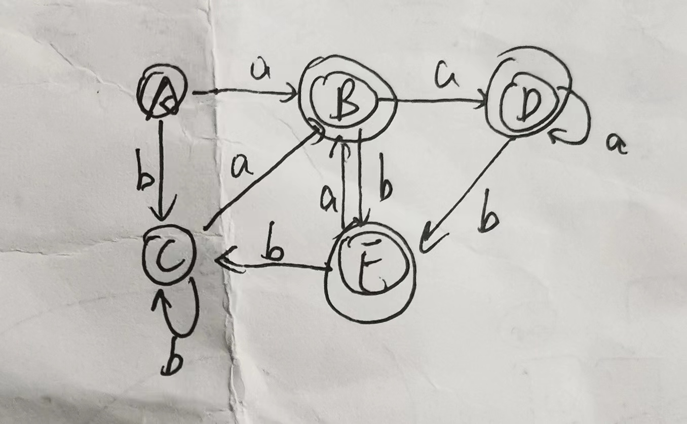
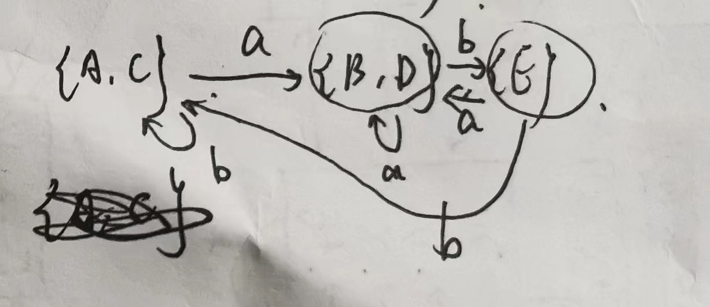

## 编译原理

- by zyf

### Notes

- 基于fy老师的PPT。
- 笔记格式为：列出PPT某个页码（或页码范围），针对课件的内容进行解释
- **<font color="skyblue">蓝色字体</font>**为不确定的部分。**<font color="red">红色</font>**及**加粗**字体为部分重点知识。
- 如有疑问联系yunfzhou@zju.edu.cn


### Ch1 Introduction

- 略。可看课程攻略共享计划的A4纸

### Ch2 Lexical Analysis

- [参考xyx笔记](https://xuan-insr.github.io/compile_principle/1%20Lexical%20Analysis/)。

- **<font color="red">minimization的步骤举例</font>**:
  - 
  - 首先分成两大类：终结状态和非终结状态，即$\{A,C\}$和$\{B,D,E\}$
  - 然后分别检查这两个状态里的每一个元素，$a$转移和$b$转移是否转移到同一个类。例如$A$的$a$转移和$C$的$a$转移一样，都是转移到$\{B,D,E\}$那一类，$b$转移也一样，都是转移到$\{A,C\}$自己，所以不拆开；$B,D,E$的$a$转移都是到$\{B,D,E\}$自己，但$B,D$的$b$转移到$\{B,D,E\}$自己，而$E$的$b$转移到$\{A,C\}$，所以要把$\{B,D,E\}$拆成$\{B,D\}$和$\{E\}$两类。
  - 再对这三类的每一个字符都重复上述过程，发现不能再继续拆了，所以这就是minimization DFA的全部状态。如下图：
  - 
  


### Ch3 Parsing

- [参考xyx笔记](https://xuan-insr.github.io/compile_principle/2%20Parsing%20%28I%29/)。一些杂项列于下面。
- **<font color="red">等价地，一个文法是 LL(1) 的，如果</font>**：

- 1. For every production $A→α_1|α_2|...|α_n$, $First(α_i) ∩ First(α_j)$ is empty for all $i$ and $j$, $1 ≤ i, j ≤ n, i ≠ j$.
  2. For every non-terminal *A* such that *First(A)* contains $\epsilon$ , $First(A) ∩ Follow(A)$ is empty. 
- 对上面的理解：其实就是保证按照“构造predict table”算法填表的时候，能不填到同一个格子里
  
- LL(1)对应**Top-down parsing**，后者用到的操作有**match**（terminal的匹配）, **generate**（使用了规则把non-terminal变成terminal）和**accept**
- 判断题
  - Left-recursive CFG cannot be LL(1). 这是对的，这样想：肯定有一条形如$A\rarr A\alpha_i\ (i \in N)$的规则，肯定还有一条$A\rarr \beta_j\ (j \in N)$的规则，rhs的first集合的交必有$\beta_j$，不空，所以不会是LL(1)。**注意LR(1)是可以处理左递归的**
  - The parse tree will completely reflect the derivation steps for a string. 错，因为没讲树的节点的生成顺序。我可以任意方式生成这棵树（比如前序后序中序）。
    - 关于parse tree的补充：Parse trees correspond quite closely (but not exactly) with abstract syntax。要区分abstract syntax vs concrete (parse) syntax

- 编译器各个层
  - Lexical Analysis: Create sequence of tokens from characters (Chap 2)
  - Parsing: Create abstract syntax tree from sequence of tokens (Chap 3)


#### 3.5 Error Recovery（对应PPT：compiler-3-3(parsing)）

##### p21-23

- 核心的想法就是想让error不影响到parsing，即便检查到error，那就跳过error的部分，继续往下解析
- yacc的做法就是引入一个特殊的error symbol
- p22的做法是，遇到了error以后，要找到第一个`)`或者`;`，因为在第一个`)`或者`;`之前都属于error的部分，不能再分析了，得跳过
- p23具体的算法
  - 首先如果有必要的话，就要Pop出一些状态，原因是在做p22的parsing时，可能对于`exp -> ( exps )`（或者`exps -> exps ; exp`）实际的操作是`exp -> ( a b c error )`（或`exps -> a b c error ; exp`），即我已经解析了一部分，然后才遇到error的（遇到error的时候就直接插入这个特殊的error符号）。那我需要一直pop到`exp -> (`（或`exps -> `）
  - 然后push `error`（对应算法第二步），才有可能满足右上角的规则`exp -> ( error )`（或`exps -> error ; exp`）。这样就可以正常规约为`exp`或`exps`，才可以正常分析下去
  - 第三步意思是忽略掉这部分产生error的输入，即跳过这部分输入继续parsing


##### p24-25

- **<font color="red">一个具体的例子，掌握！</font>**


##### p26-27

- Burke-Fisher error repair这个方法是真的去改程序员的输入了。p27是一个例子，就是往前看k=6个token，结果放到current stack。old stack就是n步（$n\ge k$，因为不一定每一步都shift一个字符）以前的current stack的样子。其实编译器内部会有一个长为$k$的队列，每shift一个进去，那就有一个元素出队，并且被old stack处理。
- 如果遇到了error，那就用老的stack替换新的stack，修改了队列里的某个token以后，重新从老的地方开始
  - 如果已经过了这个错误点超过$m$个字符，都没有发现error，那就说明改对了。之后的错误就算作新的错误，从新的错误点recover
  - 反之就说明改错了，重新再改。


### Ch4 Abstract Syntax

##### p4-5

- 如果像p4这种会出现左递归，虽然理论上确实可以通过右下角的代码做出来，但实际不能运行。
- 原始的文法是：`S -> E $`, `E -> E + E`, `E -> E - E`, `E -> T`, `T -> T * T`, `T -> T / T`, `T -> F`, `F -> id`, `F -> num`, `F -> ( E )`
- 去除左递归就变成p5. 以`E`为例，注意最好不要改成`E' -> + T E`而是`E' -> + T E'`！


##### p6-7

- 因为$FIRST(T)=\{id,\ num,\ (\}$，所以`T()`中如果遇到first集合的任何一个，那就可以先执行`F()`，得到结果以后再作为参数传给`Tprime()`（`Tprime()`对应$T'$）。**`T()`函数的first集合不包含空，所以不用考虑follow集合**
- 因为$FIRST(T')=\{*,\ /,\ \epsilon\}$，所以还要考虑$FOLLOW(T')$。首先看$FIRST(F)=FIRST(T)=FIRST(E)=FIRST(S)=\{id,\ num,\ (\}$, $FIRST(E')=\{+,\ -,\ \epsilon\}$。然后$FOLLOW(E)=FOLLOW(E')=\{),\ \$\}$，$FOLLOW(T)=FOLLOW(T')=\{+,\ -,\ ),\ \$\}$（具体可见3-1 PPT p53，当然PPT上是单独用nullable来表示$\epsilon \in FIRST$所以在FIRST集合里就省略了）
  - 这里没写完，除了TIMES的情况肯定还有DIV的情况
  - $\epsilon \in FIRST(T')$，所以还要考虑一下follow的字符。即PLUS，MINUS，RPAREN，EOF（这里没写MINUS）。follow的意思是，如果遇到这些字符，表明`T'`已经解析完了，所以要返回a。
- 注意`F()`的`case LPAREN`的情况。要**顺便把那个E给处理了**。


##### p10-11

- parse tree, concrete parse tree, abstract syntax的定义


##### p12-16

- 举了一个文法的例子，用了`A_Stm_`数据结构来实现


##### p18

- 如果要引入position，记下每部分语法树对应于源代码的哪个位置，那可以引入pos变量，即引入规则`pos ->`，并把pos插入到原先的规则里（比如`exp -> exp PLUS pos exp`）


### Ch5 Semantic Analysis

#### 5.1 Symbol Tables

##### p3-4

- 随着不断读取文件，符号表的变化
- $\sigma_0$是`function f`外面的环境
- 这个$+$运算符的意思是，如果有相同的变量名，后进来的信息将会覆盖先前的信息。当离开这个作用域时才会恢复以前的信息。所以这就是典型的stack
- 其实可以把$\sigma_2$和$\sigma_3$合并了，直接就是$\sigma_1+\{j \rarr int,\ a\rarr string\}$，因为它们都是同一个Let定义出来的作用域
- functional style就是同时可以看到几个$\sigma$，但imperative style是破坏了$\sigma_1$然后改成了$\sigma_2$。所以在$\sigma_2$作用域里是看不到$\sigma_1$的。除非做完以后undo才能恢复回$\sigma_1$


##### p5-6

- 多个符号表的情况，其实就是有多个作用域的情况
- 了解即可


##### p7-8

- 用hash的方法，代码实现。
- 认为如果出现同一个hash值的情况，就搞一个链表


##### p10-12

- 考虑了一些性能优化的问题，我们希望能同时保持多个作用域，而且我们想用多个符号表来表示多个作用域。这种情况下，可以采用一些浅拷贝的策略（p11-12）来提高性能


##### p14-19

- 对于Tiger语言的符号表的实现
- p14 destructive-update hash table的意思是，如果没有别的信息，不能在离开作用域的时候恢复之前的symbol table。事实上，如果只有p7-8的代码，那确实是不能实现的，因为不知道要pop哪些变量出去才能恢复之前的table
- p16可以发现hash table的链表是头插法，也就是stack的形式，这就便于实现the most closely nested rule for block structure，即根据作用域一层层往外查找变量
- **<font color="skyblue">`S_beginScope`和`S_endScope`是啥？</font>**


#### 5.2 Bindings for the Tiger compiler

- 略


### Ch6 Activation Records

#### 6.1 Activation Records

##### p2-4

- 想说明的问题是，如果只考虑p2的情况，那只用比较简单的栈就可以了，但如果考虑了p3的情况，即函数内定义函数，那不能在执行完f的时候就把g的所有内容pop掉，否则外界就无法访问局部变量g了


##### p6-9

- 一个经典的栈结构，向下（高地址往低地址）生长
- temporaries是函数生成需要的一些临时变量，saved register是寄存器的软件保护
- argument就是形参
- 有的书会把上面一个argument, local variables, return address放在current frame里，下一个argument归next frame。这个其实本质是一样的，因为argument一定是调用程序准备好，被调用程序拿来使用的
- **<font color="skyblue">这里老师怀疑写反了，应该都是动态链。这里认为control link和dynamic link是同一个意思</font>**
- 这里的stack pointer和frame pointer实际保存于下面那个static link。stack pointer永远指向栈顶，frame pointer记录的就是call了一个子程序之前的stack pointer。所以如果current函数执行完了，直接让stack pointer值为frame pointer即可


##### p10-17

- **<font color="skyblue">展示control link，到底要看哪一种？这几页的格式从上到下是按参数、access link、control link、return address（需要注意return address是call指令所在位置+1）、局部变量来写的。以及这个指向有什么讲究</font>**


##### p18-22

- p18有caller-save register和callee-save register两种寄存器
- p19的意思是，比如我让4-6个寄存器来放函数的参数，这样对于4-6参数以内的函数，就不用把参数放在内存里了。当然太多参数的话，还是得把多出来的放在内存。
- p20对于leaf procedure，不需要把arguments放到内存里，做完了就自动被覆盖掉了；有些优化的编译器就尽量分配不同的寄存器给不同的Procedure，这样可以充分利用所有的寄存器，减少内存的写入读取；p21还有一些register allocation的东西
- p22意思是，C语言的参数一定是存放在连续地址的，这样便于寻址


##### p23

- return address，这部分以前的汇编讲过了


##### p24-25

- **<font color="red">作业题！从寄存器写回内存的几种原因</font>**


##### p26-27

- static link（access link）和前面的dynamic link(或者叫control link)不同，这用于嵌套定义函数的地方（所以C没有static link）
- p27的lambda lifting：`g`调用`f`，`g`内的变量也会对`f`可见，所以要传给`f`。


##### p28-31

- p28的这个程序，`main`调用`p`，`p`调用`r`，`r`调用`q`。`p`和`r`都有自己的`n`，但`q`只能访问`p`的`n`，这显然不能通过control link来实现。因为`q`的control link只指向`r`，没法访问`p`的`n`。因此加一个access link。
- 实际上access link的意思就是理清楚一个函数是在哪一层被定义的。在全局被定义的函数不需要有access link，它只需要control link就能访问到全局变量。但在全局定义的函数内部，再定义k层嵌套函数，就得理清楚access link了（如p31所示）。
- C只有全局的函数，所以不用access link。
- 理解：frame的作用是保留函数之间调用的信息，但具体的变量语义和值还是放在hash table里的。


#### 6.2 Frames in the Tiger compiler

- 略


### Ch7 Translation to Intermediate Code

#### 7.1 Intermediate representation trees & 7.2 Translation into Trees

##### p3-4

- 中间代码（IR，intermediate representation）的好处在于可移植性。否则直接从编程语言到机器码，那要开发很多种转换器
- 一般会以IR为界限，把parser那些称为前端，把之后的称为后端


##### p7

- 三地址码
- 四元组：包括了operation，不用的地址置null


##### p11-12

- **<font color="red">用树来表示三地址码，定义的各种规则</font>**
- 关于TEMP的说明：A temporary in the abstract machine is similar to a register in a real machine. However, the abstract machine has an infinite number of temporaries. 即不考虑寄存器个数
- NAME(n)的n一般比如说函数名，如n=concat
- ESEQ：s计算出的结果会对计算e有副作用，它和SEQ的区别在于，它是有值的，值为计算了e以后的结果
- **<font color="skyblue">JUMP的labs是什么？</font>**
- MEM是取某个地址中的值，**是以word为单位的**
- EXP是丢弃结果的
- SEQ（a, b）也可以理解为源代码是按照`a,b`这样运行的，就是用了逗号运算符。它可以用在函数参数列表中


##### p15-16

- 代码实现方面
  - **ex**代表那种有结果的表达式（expression），比如a+1，**nx**代表没有结果的语句（statement），比如jump，**cx**代表那种CJUMP的，就是有比较的。而且注意cx这种在evaluate里面的表达式时，是不需要把值存到某个temp的，而是直接决定跳转到哪里
  - 可以发现，`a>b | c<d`转成IR时会出现很多NULL。那么就需要底下的patchList的结构定义，以及按照上面`T_stm`的构造，把`trues`, `falses`的地址记下来，后面知道往哪走的时候再去写回去这个变量，具体跳到0x多少的地址


##### p17-20

- tree节点转换成ex, nx, cx结构
- `unEx`这个函数是把tree节点转换成三种类型
  - ex, nx是比较平凡的情况，重点讨论cx（p19）
  - 效果是蓝色框里的，已经很接近汇编语言了
  - **<font color="skyblue">p20看不太懂</font>**


##### p21-24

- 简单变量的存放
- 注意p23，**可以简化写tree**，
- **<font color="skyblue">p24？</font>**


##### p25-32

- Pascal支持数组通过=拷贝，但C不支持
- p27的左值和右值：左值可以作为右值，但右值不可以作为左值
- scalar: an integer or pointer value is a "scalar“: it has only one component. (one word of memory and can fit in a register ).
- p31是关于数组的下标引用如何翻译成tree，为何e要取MEM？
- p32是关于数组下标越界的讨论，不重要


##### p33

- 数值运算：

  - 整数：单目负号可以用0-正数来完成，单目取反运算可以用1去异或所有的bit
  - 浮点：因为很多浮点表示中允许使用-0和+0，所以我们认为这里不支持浮点取相反数

- 分支：

  - 首先`&`和`|`可以转成`if then else`的形式
  - 那么编程语言中如果有`if then else`，则做类似p35的套路
  - p35应该写错了，tree对应的应该是`if x < 5 then ... else if a > b then ... else 0`

- 结构的创建：

  - 内容放在heap上
  - 方法是可以调用一个外部函数，分配N个连续的word，然后如果带有初始化的话，就得连续执行一堆MOVE
  - 具体可以看p37

- for和while语句

  - 首先for可以转成while
  - 然后while就按照p39的操作来构建tree

  

#### 7.3 Declarations

##### p3

- 变量定义
- 因为函数内部还要定义一些临时变量，所以需要在frame中预留这部分空间


##### p4-5

- 函数定义
  - prologue（可以理解为header一样的东西）
    - pseudo-instructions to **mark the beginning of a function;**
    - a **label** definition for the function name;
    - an instruction to **adjust the stack pointer**
    - instructions to save **"escaping"** arguments into the frame, and to move “nonescaping” arguments into fresh temporary registers;（就是决定应该把变量放在Memory还是register）
    - store instructions to save any **callee-save registers** including the return address register
  - body
  - epilogue
    - an instruction to move the **return value** (result of the function) to the register;
    - load instructions to restore the **callee-save** registers;
    - an instruction to reset the **stack pointer**;
    - a **return instruction;**
    - pseudo-instructions, as needed, to **announce the end of a function**.


### Ch8 Basic Blocks and Traces

##### p2-6

- 本章的目标在于对IR进行优化，因为上一章设计的IR和machine code差别还是太大了，要尽量缩小与machine code的区别，才能更好地转成machine code

- 具体而言
  - CJUMP指令其实只用记一个跳转的地址即可，因为真或者假必有一个是紧跟CJUMP的，记两个地址的意义不大。所以就认为，**为真就jump，为假就不jump**
  - ESEQ、CALL会导致一些计算、写次序的问题
- p5-6简单介绍了接下来的三部分工作


##### p8-19

- canonical tree的特征
  - 没有SEQ或ESEQ
  - CALL的parent要么是EXP要么是MOVE（TEMP t, ...）
- 关于ESEQ的转换
  - idea基本都是尽量把ESEQ往根的方向提升
  - 首先，p9父子的ESEQ可以变成一个SEQ和一个ESEQ。这个很显然，因为遍历树的时候是执行完s1和s2才会去计算e
  - 然后p10的一些比较显然的转换。因为ESEQ本质上就是先执行一些statement，那些statement可能会对计算e有影响，那我可以一开始就执行那些statement，这样就肯定会对我接下来要算的e产生了影响
  - 结合p10和p11，可以发现
    - 单目运算符（比如MEM，JUMP）就只用讨论一种情况即可。而且JUMP由于都已经跳转了，所以就没必要再保留ESEQ了，直接就是SEQ了
    - 双目以上的（比如CJUMP, BINOP）
      - 如果是第一个操作数出现ESEQ，那直接把ESEQ提升即可。
      - 但如果是第二个操作数，那不能简单地提升ESEQ，因为ESEQ对s的计算可能会影响e1，所以先算s和后算s可能会导致e1不同。所以要把e1的结果放在TEMP中。这样会形成两个父子ESEQ，那可以进一步用p9的方法变成一个ESEQ
      - 如果s和e1可以交换，即s的计算结果不影响e1，那就很简单了
      - 那如何判断可交换？p13讨论了两种显然的情况：e是常数；s是空statement；其他都不能判断，都当成不可以交换
  - p14-16: general rewriting rules
- 关于CALL的转换
  - p17介绍了连用CALL的问题，RV寄存器会被覆写
  - 所以需要保存好第一次CALL的值，做p18的处理

- 关于连续的SEQ：实际上就直接丢掉SEQ就行


##### p22-23

- basic block的特征
  - 第一句是LABEL
  - 最后一句是JUMP或CJUMP
  - 中间不能有LABEL，JUMP，CJUMP
- 划分basic block的算法
  - 从头扫描到尾，以LABEL、JUMP、CJUMP为界限来划分block
  - JUMP、CJUMP跳转的目标如果没有LABEL，则需补上LABEL，并做好划分
  - 检查每个block，如果哪个block最后没有跳转，就补上跳转到下一个block的JUMP语句


##### p25-29

- 有关trace
  - 因为CJUMP如果条件是false，那就不跳转，也就是CJUMP后应该紧跟false的语句
  - 而且我们可以把JUMP后的block放在紧跟着有JUMP的这个block的后面，这样的好处在于去掉JUMP，不用跳转
  - 最好能找到一系列这样的trace，能完全地、不重叠地覆盖整个program，而且trace越少越好
- p27是一个举例，p28是算法
- p29是一些CJUMP的处理
  - 如果CJUMP后恰好跟着true的标签，那就对CJUMP的条件取反，这样false的标签就跟在CJUMP后面了
  - 如果CJUMP后既不跟着true也不跟着false，那就加一个新的label，让它跳转到false label


##### p30-31

- 一些优化的手段。一般来说我们应该尽可能想办法省略loop部分的JUMP
- p31：这里的CJUMP很难去掉，但loop中的JUMP是可以通过重新排列basic block去掉的。最下面那种操作是optimal的，因为prologue那里的jump只用执行一次


### Ch9 Instruction Selection

##### p2-5

- instruction selection的目标就是选择合适的机器指令，将IR code -> machine code
- p4的意思是，有些IR指令对应于很多种tree pattern。
- **<font color="red">p4这个图要记住！</font>**
  - 首先这里有点像RISC-V中的$x_0$寄存器，它也有$r_0$寄存器，恒为0
  - TEMP节点是不产生指令的
  - CONST节点一般可以跟随例如LOAD STORE指令，但有时候也会单独产生指令（即ADDI）。因为没有MULI，所以如果实现一个常数乘一个寄存器的话，就必须先ADDI把常数存到一个寄存器中，再用MUL指令实现两个寄存器的相乘
  - LOAD节点的三种特殊情况可以根据$r_i \larr M[r_j+c]$来记忆。三种特殊情况是，$r_j=r_0$，那就只有CONST节点；同时有$r_j$和$c$，那就存在左右关系的问题。还有一个一般的情况就是只有MEM这个node的pattern，因为MEM下面的节点可以是除了+和CONST以外的节点（例如\*）
  - 记住LOAD就能推出STORE。STORE对应的tree pattern其实就是在LOAD的基础上加了一层MOVE
  - MOVE还有一种情况是MOVEM，就是两个child都是MEM

- 所以p5说需要用一些tile把这棵tree不重叠地完全覆盖


##### p6-7

- 有不同的方法能不重叠完全覆盖，区别主要在第8-9步
- p7的方法是**每次只包括一个节点**


##### p9

- 区分两个词：
  - **optimum tiling**: the one whose tiles sum to the lowest possible value.
  - **optimal tiling**: the one where no two adjacent tiles can be combined into a single tile of lower cost.
  - **Every optimum tiling is also optimal, but not vice versa!** 但一般来说optimal的算法比较好操作


##### p12-13

- maximal munch算法
  - 从根节点开始找最大的tile（如果有两个tile并列大那就任选其一），这样的tile会cover根节点及它的一些子节点，剩下没cover的部分实际上是若干棵树，那再对这些树做一样的算法
  - **<font color="red">注意tile只能从p4的图中选！！</font>**
  - 这是一个**optimal**的算法
  - 注意由于是从根开始的，所以可以认为Munch的顺序是前序遍历，但**真正生成代码的顺序是后序遍历**


##### p16-19

- Dynamic Programming（<font color="skyblue">没看懂？</font>）


##### p20-23

- Tree Grammars
  - 是一种CFG
  - <font color="skyblue">没看懂？</font>


##### p24-25

- Fast Matching
  - 好像就是用了switch-case语句优化了一下，不用一个个查哪种是最优的


##### p27-32

- RISC和CISC的区别
  - CISC只有16-的寄存器
  - CISC是二地址码，当然这也会增加更多的指令
  - CISC还有个问题，就是在访问内存的时候会自动+4，这样的指令比较影响tree pattern的分析，解决的方法有：完全忽视、专门讨论这种特殊情况、用DAG pattern而不是tree pattern. 应该不是重点


### Ch10 Liveness Analysis

##### p2

- 初步来研究寄存器的分配。首先得搞清楚哪些变量在什么阶段会被使用，什么阶段就不活跃，就可以腾出寄存器给别的变量了
- 这样可以让尽可能多的变量放在寄存器而不是内存里


##### p3-5

- 首先有一个控制流图，目前暂时是一条语句占一个node
- 然后通过p4的分析发现a, b活跃的range正好是错开的，所以有p5的结论是一个寄存器可以放两个变量，另一个寄存器放c


##### p6-8

- 一些术语
- in-edges, out-edges
- use: 在rhs
- defines: 在lhs
- use和define都是针对一个node而言的
- live on是针对edge的
- live-in, live-out是针对node的
  - live-in的意思是：这个变量进到node n时是活的
  - live-out的意思是：这个变量从node n出去的时候还是活的


##### p9-12

- 计算liveness
  - 如果一个variable被n使用，那它在`in[n]`里；或者一个variable在`out[n]`里，但是它没在n里被重新定义，那认为它也在`in[n]`里（第二种情况是因为可能这个node暂时没用到该变量，但该变量将在以后的node中用到，那么也认为它进来的时候是live的）
  - 要求一个variable的out，我们就看它所有**孩子（注意别搞错！）**的所有`in`集合，取并。因为**in集合里的变量都是有被使用的潜在可能的**，所以把紧跟的每个successor的in全部算进去肯定不会漏掉
  - 这里提到“in集合里的变量都是有被使用的潜在可能的”，只能说是“潜在可能”，因为根据p19-21的讨论，没有普适的算法可以判断这个变量在以后的basic block中是否一定会用到/一定不会用到。所以我们宁可多估计一些以后会被用到的变量，也不要漏了
  - **公式**：
    - $in[n]=use[n]\ \cup\ (out[n] - def[n])$
    - $out[n] = \cup_{s \in succ[n]}\ in[s]$
  
- p11举例
  - 一开始先算了use和def，由于out还没算，所以在算In的时候就当Out是空集。所以step 1的in和use一样，out也就只有5可以看到2的in
  - 注意在计算的过程中，是按照每个node分别算的，每个node里先算In（此时用到的out是上一轮的out的结果），再算out
  - 这样的缺点在于收敛速度太慢了，改进的方法是可以**“反着”算**（因为算out是要往succ看的），当然这里我们只看主要的那条control flow即1-2-3-4-5-6，所以反着算就是p12。**先算out，这样in就可以用刚算的out的结果**。


##### p13

- 还可以进一步减少计算量：（上面是从减少迭代次数来考虑，这里可以从每次迭代要考虑的node个数来考虑）我们可以按照basic block来考虑，这样node的数量会更少，但是计算liveness的方法仍然不变
- 或者可以用one variable at a time的想法


##### p14

- set的表示
  - 可以用位来表示。但这样的话就得需要近32个变量才会比较值（假如是K=32位的系统），这样做集合的并就是做或运算
  - 可以用链表，这种适用于变量比较少的情况


##### p15

- 时间复杂度的讨论
  - 因为一条语句定义0或1个新变量，所以size N的程序最多只能有N个变量
  - 因为Union是$O(N)$的，所以for loop要$O(N^2)$的时间
  - 外层还有一个repeat until的循环，那可以这样想：每次迭代肯定会使得某些in或out集合的元素增加。那所有in和out集合的所有元素之和是$2N^2$，最坏的情况就是每次迭代只加了1，那就得有$2N^2$次迭代
  - 所以两者相乘最坏理论上有$O(N^4)$，但一般实际情况介于$O(N)$和$O(N^2)$之间


##### p16-18


##### p19-21

- 这里有一个例子，算出来的$a \ge 0$，那么一定有$c \ge b$，理论上永远不会走`return c`分支。但其实我们找不到一个普适的办法来判断一个分支是否永远都不会走（这里的方法并不普适，它只是一种$a \ge 0$的特殊情况）。
  - 这涉及到停机问题。原始的停机问题如p20，可以得到一个$F(F)$，它的表现和$H(F,\ F)$的判断是相反的。
  - 那么我们可以得出一个推论：找不到一个$H'(X,\ L)$的程序，给定程序X和标签L，$H'$可以判断X能到达L标签。构造的方法就是把原来的Halt语句改为goto L语句。即`F(Y, L) = if(H'(Y, L)) then (while true do ()) else goto L; L`。即Label L打在F的末尾。那`F(F, L)`就矛盾了。
  - 所以我们可以总结出p21的两种liveness。编译器只能知道static liveness，即认为每个分支都可能走到。dynamic liveness就是实际运行时的liveness，这个是没有普适的方法可以事先预测的。区别就在于一个是execution一个是control-flow edges
- **if `a` is dynamically live, it is also statically live.** 


##### p22-24

- interference graph：描述两个变量的conflict的图，即两个变量不能放在同一个寄存器里。是一个undirected graph。所以如果用matrix来表示的话，那必须得关于对角线对称
- **<font color="skyblue">如何构造interference graph的edges（不确定是否理解正确）</font>**
  - 所有“不是move”的instruction来定义的`a`变量（如$a \larr b+c$这种不是直接拿某一个变量所在的寄存器赋值给另一个变量），就把basic block的liveout的变量都和`a`变量连上线
  - 所有“是move”的instruction来定义的`a`变量（如$a \larr c$），把basic block的liveout的变量**（除了`c`以外）**的都连上边。之所以“除了`c`以外”是因为在这条语句以后`a`和`c`是一样的值，至少在这一步没必要分给两个寄存器


### Ch11 Register Allocation

##### p5-24

- 实际上就是一个**图着色**的NP完全问题，**假设用K种颜色涂一个图G，步骤如下：**

  - **build**：构建interference graph。一般而言，对于a ← b这种指令，(a, b)这条边是画虚线的。

  - **simplify**：找到一个node m，它的邻居个数< K，那么如果G’ = G – {m}是K-colored的，那么G也是K-color的，所以可以把m放到一个stack里，不断重复该步。

  - **coalesce**：后面会讲。

  - **freeze**：If neither simplify nor coalesce applies, we look for a move-related node of low degree. We freeze the moves in which this node is involved. We **give up hope of coalescing those moves**. Simplify and coalesce are resumed. 

  - **spill**：在simplify过程中，如果发现了degree≥K的node m’，也“假设”其邻居有重复颜色的，所有颜色个数加起来<K，也把这样的m’放到stack里

  - **select**：**不断pop stack，恢复原来的图，边恢复边着色（注意一定是从顶到下赋颜色）**，如果颜色超过了K，那就构成了actual spill，这时得考虑放memory里，**需要重写program，加上load和store的逻辑，这时必须重新从build阶段开始做，一直到一个完整的iteration中不发生任何一次spill才顺利结束。**

  - **合并**（coalescing）的原理：专门针对a ← b这种类型的instruction，合并a和b可以少分配一个寄存器（前提是这俩节点不能有实线连接（不能冲突））。**策略有**：
    - **Briggs**。其原因：合并以后可以把non-significant的邻居全部simplify掉，剩下的如果<K，那这个合并节点也可以被simplify掉，也就等价于合并前的两个节点都被simplify掉，不影响整个图的colorability
    - **George**。


##### p26-28

- 有一些寄存器是有固定用途的，例如参数、返回值寄存器，这些是不能被简化的，它们预先已经被分配寄存器了（pre-colored）
- callee-save register：被调用者保护。即在函数内部自己保存和恢复某个寄存器
- 局部变量和编译器的临时变量等不跨procedure活跃的变量，就用于caller-save register。**这个不保护变量。**
- 全局变量等跨procedure的变量，就用于callee-save register。**这个能保证这个变量能被恢复**


##### p ?-41（未整理）


### Ch13 Garbage Collection

- 这其实是运行时的一个问题了

##### p4

- 像这里`in garbage-collect here`，7和9那个环形链表是已经访问不到了，应该要被回收


##### p6

- mark phase: 有一个图来管理这些变量。这里用“mark-sweep”的方法，先遍历图对能到达的变量进行标记（如果哪些变量无法到达，那说明应该垃圾回收）。
- sweep phase: 然后从头到尾遍历一遍heap，用一个freelist来把garbage连成一个链表，另外还需要unmark已经被mark的变量，以准备下一次garbage collection


##### p7-8

- 具体的算法
- DFS来遍历图mark
- 然后就扫描一遍heap进行sweep，这里注意会利用`p`的第一个field来记链表下一个节点的地址，所以有`p.f1 ← freelist`，然后`freelist ← p`意思就是让list这个变量的值为当前地址值（即链表头插法）。注意循环的步长是变化的！`p`取决于record的大小自增
- p8是一个例子，回收了7和9这俩record


##### p9-10

- mark-and-sweep的cost
- 因为DFS 做mark这件事的次数和R是有一个比例关系的，比值为$c_1$即某个常数，做sweep这件事和H也有一个比例关系，所以总费用是$\frac{c_1 R+c_2 H}{H-R}$，也就是如果$H$和$R$很接近的话，即回收不了什么东西的话，这时候跑这个算法的代价很高。所以当R达到H的某个比例时要开辟新的内存
- 此外，DFS递归调用开销太大，可能活动记录对应的栈都比heap还大，那必须要改成非递归的形式，如p10的效果

- 但是p10仍然需要维护一个栈，其实对图的遍历还有不用栈的方法，即指针反转（p11）


##### p11

- Pointer reversal算法（改了一下变量名，好记一些）

```c
//done[x]: x这个节点有多少个child已经完成了
//i: 就是每个record内部的index，从0开始
//cur.fi的意思就是cur的第i个field

function DFS(cur)
if cur is a pointer and record cur is not marked
	parentnode ← nil
	mark cur; done[cur] ← 0
	while true
        i ← done[cur]
        if i < # of fields in record cur
        	childnode ← cur.fi
            if childnode is a pointer and record childnode is not marked
                cur.fi ← parentnode; parentnode ← cur; cur ← childnode
                mark cur; done[cur] ← 0
            else
            	done[cur] ← i + 1
        else
            childnode ← cur; cur ← parentnode
            if cur = nil then return
            i ← done[cur]
            parentnode ← cur.fi; cur.fi ← childnode
            done[cur] ← i + 1
```


##### p13-14

- 引用计数：就是当有一个指针指向某个record就对关于这个record的计数器+1，不指向了就-1，注意如果把指针从一个record改成指向另一个record，+1和-1都会发生！
- 当引用计数=0时这段record就放到freelist中
- p14提到引用计数存在两个问题：
  - 对于环状链表，引用计数不会减到0，无法回收
  - 引用计数对计数器+1其实是很昂贵的操作（要插入很多指令）

- 关于第一个问题的解决方案有两个：
  - 摆烂，让程序员自己小心不要搞出这种孤岛
  - 结合mark-sweep算法，大多数时候用引用计数，偶尔来一下mark-sweep把环状的东西消除


##### p17-18

- 结合p18，p17的意思就是from-space里可能会有很多碎片，然后这些record之间链接成一张图。因为allocate空间的时候指针是一直自增的，当指针到底了（达到了from-space的limit），则在to-space中建立一块完全一样的堆，只不过这次的堆中间没有碎片（是compact的）


##### p21

- 怎么做到的可参考这个例子。
  - 最左边图，p变量可以看成这个graph的root
  - 中间图，先动`p`和`q`，把`p`直接指的带有15的record拷贝到to-space中，把`q`直接指的37也拷过来。`scan`不动，`next`增加。此外注意from-space中原先15和37两个record存数字的field变成指针，指向to-space中对应的record，这样可以辨别出from-space的这个record已经被copy了
